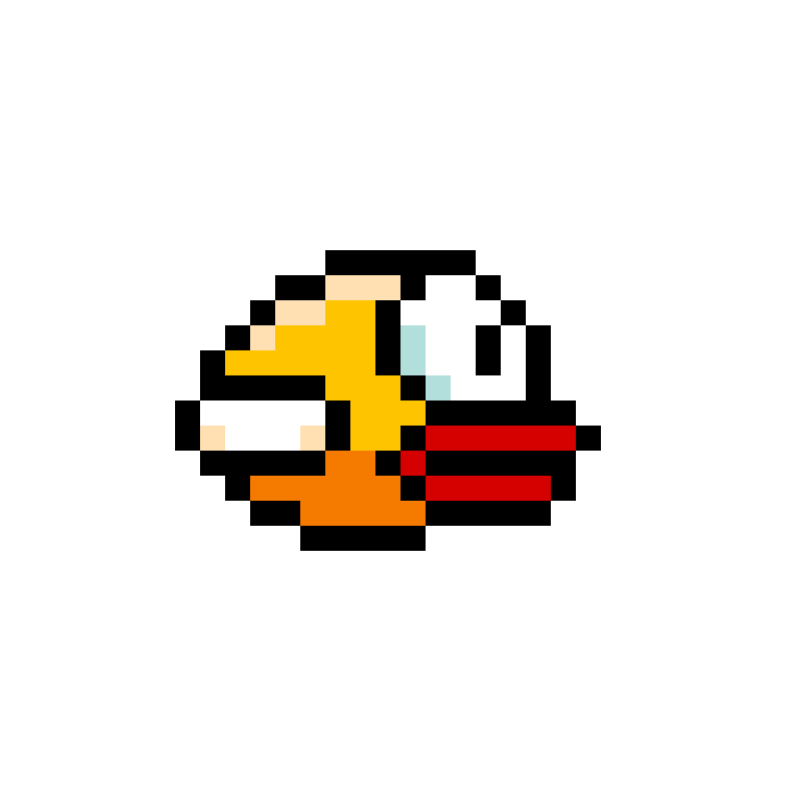

<a name="readme-top"></a>

[![Contributors][contributors-shield]][contributors-url]
[![Forks][forks-shield]][forks-url]
[![Stargazers][stars-shield]][stars-url]
[![Issues][issues-shield]][issues-url]
[![LinkedIn][linkedin-shield]][linkedin-url]

<!-- PROJECT LOGO -->
<br />
<div align="center">
  <a href="https://github.com/zockol/Flappy-Bird-Recreation">
    
  </a>

<h3 align="center">Flappy Bird Recreation</h3>

  <p align="center">
    A project to get into Unity and expand my own skills
    <br />
    <a href="https://github.com/zockol/Flappy-Bird-Recreation"><strong>Explore the docs »</strong></a>
    <br />
    <br />
    <a href="https://github.com/zockol/Flappy-Bird-Recreation">View Demo</a>
    ·
    <a href="https://github.com/zockol/Flappy-Bird-Recreation/issues">Report Bug</a>
    ·
    <a href="https://github.com/zockol/Flappy-Bird-Recreation/issues">Request Feature</a>
  </p>
</div>

<!-- TABLE OF CONTENTS -->
<details>
  <summary>Table of Contents</summary>
  <ol>
    <li>
      <a href="#about-the-project">About The Project</a>
      <ul>
        <li><a href="#built-with">Built With</a></li>
      </ul>
    </li>
    <li>
      <a href="#getting-started">Getting Started</a>
      <ul>
        <li><a href="#prerequisites">Prerequisites</a></li>
        <li><a href="#installation">Installation</a></li>
        <li><a href="#build-and-play">Build and Play</a></li>
      </ul>
    </li>
    <li><a href="#todolist">To-Do-List</a></li>
    <li><a href="#contributing">Contributing</a></li>
    <li><a href="#contact">Contact</a></li>
  </ol>
</details>

<!-- ABOUT THE PROJECT -->

## About The Project

[![Product Name Screen Shot][product-screenshot]](https://github.com/zockol/Flappy-Bird-Recreation)

I started this project with a YouTube Guide and decided to take it further and develope more features into it to get started into Unity. There is no real purpose for it but learning. Special Credits to [Valem](https://www.youtube.com/c/ValemVR) for the quick guide to getting started!

<p align="right">(<a href="#readme-top">back to top</a>)</p>

### Built With

[](https://unity3d.com)

<p align="right">(<a href="#readme-top">back to top</a>)</p>

<!-- GETTING STARTED -->

## Getting Started

By following simple steps, you will be able to open this Project by yourself and develope it further or even build to play it.

### Prerequisites

[Unity](https://unity.com/de/download)

### Installation

1. Download [Unity](https://unity.com/de/download)

2. Open your Terminal and locate the directory where u want the project to be located

3. Clone the Repository

   ```
   git clone https://github.com/zockol/Flappy-Bird-Recreation.git
   ```

4. Start Unity Hub, press Open and locate the cloned Repository.

5. Feel free to Develope further

### Build and Play

1. Press on `File` on the menubar

2. Locate `Build and Settings`

3. Select `Windows, Mac, Linux` as Platform

4. Press `Build And Run`

<p align="right">(<a href="#readme-top">back to top</a>)</p>

## To-Do-List

- Menu
- Points (sum of Score)
- Skinshop (Skins are bought with points)

Feel free to [open issues](https://github.com/zockol/Flappy-Bird-Recreation/issues) to submit feature ideas and see a list of known issues.

<p align="right">(<a href="#readme-top">back to top</a>)</p>

<!-- CONTRIBUTING -->

## Contributing

Contributions are what make the open source community such an amazing place to learn, inspire, and create. Any contributions you make are **greatly appreciated**.

If you have a suggestion that would make this better, please fork the repo and create a pull request. You can also simply open an issue with the tag "enhancement".
Don't forget to give the project a star! Thanks again!

1. Fork the Project
2. Create your Feature Branch (`git checkout -b feature/AmazingFeature`)
3. Commit your Changes (`git commit -m 'Add some AmazingFeature'`)
4. Push to the Branch (`git push origin feature/AmazingFeature`)
5. Open a Pull Request

<p align="right">(<a href="#readme-top">back to top</a>)</p>

<!-- CONTACT -->

## Contact

Patrick Zockol - [@zockoL](https://twitter.com/zockoL)

Project Link: [https://github.com/zockol/Flappy-Bird-Recreation](https://github.com/zockol/Flappy-Bird-Recreation)

<p align="right">(<a href="#readme-top">back to top</a>)</p>

<!-- MARKDOWN LINKS & IMAGES -->
<!-- https://www.markdownguide.org/basic-syntax/#reference-style-links -->

[contributors-shield]: https://img.shields.io/github/contributors/zockol/Flappy-Bird-Recreation.svg?style=for-the-badge
[contributors-url]: https://github.com/zockol/Flappy-Bird-Recreation/graphs/contributors
[forks-shield]: https://img.shields.io/github/forks/zockol/Flappy-Bird-Recreation.svg?style=for-the-badge
[forks-url]: https://github.com/zockol/Flappy-Bird-Recreation/network/members
[stars-shield]: https://img.shields.io/github/stars/zockol/Flappy-Bird-Recreation.svg?style=for-the-badge
[stars-url]: https://github.com/zockol/Flappy-Bird-Recreation/stargazers
[issues-shield]: https://img.shields.io/github/issues/zockol/Flappy-Bird-Recreation.svg?style=for-the-badge
[issues-url]: https://github.com/zockol/Flappy-Bird-Recreation/issues
[license-shield]: https://img.shields.io/github/license/zockol/Flappy-Bird-Recreation.svg?style=for-the-badge
[license-url]: https://github.com/zockol/Flappy-Bird-Recreation/blob/master/LICENSE.txt
[linkedin-shield]: https://img.shields.io/badge/-LinkedIn-black.svg?style=for-the-badge&logo=linkedin&colorB=555
[linkedin-url]: https://www.linkedin.com/in/patrick-zockol-687204253/
[product-screenshot]: images/Project.png
